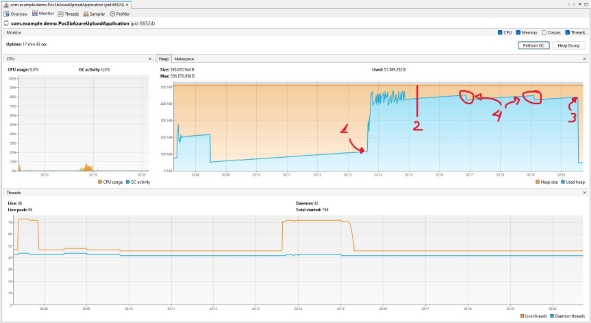

# Performance by implementação

## Resumo

> Em algumas das execuções foi necessário ajustar a configuração de size-pool.

<table><tr><th colspan="1"></th><th colspan="2">
Este método estourou

o limite de RAM
</th><th colspan="2">Uso de RAM mediano, mas não controla o fluxo de escrita.</th><th colspan="2">Uso de RAM mediano, mas tem bom controle de escrita.</th><th colspan="2">
Uso de RAM alto, mas para

arquivos <4MB sem vantagem.
</th><th colspan="2">
Este método estourou

o limite de RAM
</th><th colspan="2">Baixo uso de RAM, mas requer controle na escrita dos arquivos.</th></tr>
<tr><td colspan="1" rowspan="2"><b>ROUND</b></td><td colspan="2"><b>No streaming Buffer all data In Memory</b></td><td colspan="2"><b>Streaming (On Demand)</b></td><td colspan="2"><b>Streaming + Buffer In Memory (4KB)</b></td><td colspan="2"><b>Streaming + Buffer In Memory (4MB)</b></td><td colspan="2"><b>Streaming + Buffer In Memory (8MB)</b></td><td colspan="2"><b>No streaming Save all data In Temp File</b></td></tr>
<tr><td colspan="1">
<b>TEMPO (SEC)</b>

<b>1 MB</b>
</td><td colspan="1"><b>TEMPO (SEC) 10 MB</b></td><td colspan="1">
<b>TEMPO (SEC)</b>

<b>1 MB</b>
</td><td colspan="1"><b>TEMPO (SEC) 10 MB</b></td><td colspan="1">
<b>TEMPO (SEC)</b>

<b>1 MB</b>
</td><td colspan="1"><b>TEMPO (SEC) 10 MB</b></td><td colspan="1">
<b>TEMPO (SEC)</b>

<b>1 MB</b>
</td><td colspan="1"><b>TEMPO (SEC) 10 MB</b></td><td colspan="1">
<b>TEMPO (SEC)</b>

<b>1 MB</b>
</td><td colspan="1"><b>TEMPO (SEC) 10 MB</b></td><td colspan="1">
<b>TEMPO (SEC)</b>

<b>1 MB</b>
</td><td colspan="1"><b>TEMPO (SEC) 10 MB</b></td></tr>
<tr><td colspan="1"><b>AVG</b></td><td colspan="1"><b>1.16</b></td><td colspan="1"><b>8.82</b></td><td colspan="1"><b>1.24</b></td><td colspan="1"><b>8.89</b></td><td colspan="1"><b>1.14</b></td><td colspan="1"><b>9.03</b></td><td colspan="1"><b>1.29</b></td><td colspan="1"><b>9.08</b></td><td colspan="1"><b>1.34</b></td><td colspan="1"><b>9.10</b></td><td colspan="1"><b>1.46</b></td><td colspan="1"><b>9.09</b></td></tr>
<tr><td colspan="1"><b>AVG 5MB</b></td><td colspan="2" valign="top"><b>4.99</b></td><td colspan="2" valign="top"><b>5.06</b></td><td colspan="2" valign="top"><b>5.09</b></td><td colspan="2" valign="top"><b>5.18</b></td><td colspan="2" valign="top"><b>5.22</b></td><td colspan="2" valign="top"><b>5.28</b></td></tr>
<tr><td colspan="1"><b>MAX</b></td><td colspan="1"><b>2.73</b></td><td colspan="1"><b>19.42</b></td><td colspan="1"><b>3.45</b></td><td colspan="1"><b>21.61</b></td><td colspan="1"><b>2.55</b></td><td colspan="1"><b>23.45</b></td><td colspan="1"><b>3.87</b></td><td colspan="1"><b>24.50</b></td><td colspan="1"><b>4.01</b></td><td colspan="1"><b>24.31</b></td><td colspan="1"><b>15.31</b></td><td colspan="1"><b>22.01</b></td></tr>
<tr><td colspan="1"><b>MIN</b></td><td colspan="1"><b>0.37</b></td><td colspan="1"><b>3.52</b></td><td colspan="1"><b>0.27</b></td><td colspan="1"><b>3.07</b></td><td colspan="1"><b>0.36</b></td><td colspan="1"><b>2.59</b></td><td colspan="1"><b>0.38</b></td><td colspan="1"><b>2.86</b></td><td colspan="1"><b>0.37</b></td><td colspan="1"><b>2.53</b></td><td colspan="1"><b>0.35</b></td><td colspan="1"><b>2.51</b></td></tr>
</table>

## Uso dos recursos da máquina

Uso limitado a 512m de memória (geralmente este é o tamanho dos containers)

> Talvez seja interessante avaliar o aumento para no mínimo 1GB, isso permitiria aumentar a quantidade de operações simultâneas. (Ou o tamanho dos arquivos)

> Para medir o uso dos recursos do servidor foi utilizado VisualVM.

> A cada operação foi performado o Garbage Collector

Para todas as operações foi utilizado a configuração de *AsyncExecutor*, portanto é necessário ajustar a quantidade de *Min*/*MaxWorkers* e *Min/MaxWorkerQueue* para que a aplicação não ultrapasse o limite de memória disponível para a JVM; Para todos os testes a seguir, as configurações de worker foram as seguintes:

Conforme a configuração ao lado, para os métodos que  implementam  este  executor,  as  operações estarão  limitadas  a  no  máximo  25  operações  em concorrência  (***setMaxPoolSize***),  assim  que ultrapassar  o  máximo  de  operações  assíncronas serão enfileiradas para aguardar sua inicialização e destas  no  máximo  100  (***setQueueCapacity***) poderão ser enfileiradas. Levando isso em conta, se chegarem 200 operações em simultâneo 125 serão acatadas, as demais 75 irão “estourar” uma exceção do tipo ***TaskRejectedException***.

> Nota:  As  operações acatadas (do exemplo acima 125)  não  vão  parar  ou  deixar  de  executar caso a função principal receba uma exceção!

## Application StartUP

# Implementations

## No Streaming File

Esta é uma implementação não confiável, nem mesmo nos testes foi possível obter sucesso em todas as execuções. Pois a quantidade de memória utilizada pela aplicação é determinada pelo tamanho dos arquivos de upload da aplicação.

Dada isso, não seguirei com exemplos devido ao descarte desta implementação.

## Save in temp file

Esta é uma implementação que visava utilizar baixa memória, neste caso o consumo de memória é o disponível para I/O do sistema. Dessa forma conforme disponibilidade para escrita do arquivo o download é realizado.

> Nota 1: Esta implementação não é tão recomendada pois precisa ter pleno controle dos arquivos temporários, em caso de rodar a aplicação em containers o problema é menor pois a cada restar os arquivos temporários são apagados, mas em implementação de servidores IaaS é possível que o arquivo fique salvo/perdido.

> Nota 2: Há risco também no container, mas no momento onde o POD fica sem memória ele é reiniciado. Não é uma solução mas a aplicação não para.

### Arquivos de 1MB

Como é possível visualizar há um pico de memória, mas este não gera exceção devido ao sistema utilizar somente o disponível para escrita.

 

1. Início da operação
1. Aproximadamente o fim da operação
1. Execução do GC manualmente

**Tempo:** 10.6737162**s  
Média por arquivo:** 2.030**s   
Pico de memória:** 529.307**b**

### Arquivos de 10MB

Conforme pode ser observado, para arquivos de 10MB o comportamento se repete.

Podemos concluir também que não surge uma grande vantagem, afinal é necessário realizar toda a escrita do arquivo localmente para assim iniciar o processo de upload.

 

1. Início da operação
1. Aproximadamente o fim da operação
1. Execução do GC manualmente

**Tempo:** 1**m** 19.722022**s  
Média por arquivo:** 15.391**s  
Pico de memória:** 516.771**b**

## Upload Streaming File

Para performar essas operações foi utilizada a implementação de streaming do arquivo, isto é, enquanto o download era realizado o arquivo era enviado para a Azure.

> Nota 1: Neste método o “arquivo” é salvo em memória (buffer), sendo assim a cada ciclo de leitura do inputstream (body da requisição) é “gasto” aproximadamente o tamanho do buffer.

> Nota 2: Foram realizadas 125 operações de upload “simultâneas”. > *devido ao controle de thread-pool nem todas vão iniciar de *imediato!*

### Buffer de 4KB

#### Arquivos de 1MB

 

1. Início da operação
1. Aproximadamente o fim da operação
1. Execução do GC manualmente

**Tempo:** 10.6762119**s   Média por arquivo:** 1.556**s   Pico de memória:** 300.711**b**

#### Arquivos de 10MB

 

1. Início da operação
1. Aproximadamente o fim da operação
1. Execução do GC manualmente

**Tempo:** 1**m** 21.1770179**s   Média por arquivo:**   15.721**s   Pico de memória:** 486.858**b**

### Buffer de 4MB

#### Arquivos de 1MB

Para os casos de arquivos com 1MB nao vemos vantagem alguma, pelo contrário a performance deteriorou.

Devido ao alto volume de memória perdida o tempo de upload piorou. > Além da memória usada de forma indevida

 

1. Início da operação
1. Aproximadamente o fim da operação
1. Execução do GC automaticamente

**Tempo:** 10.6058811**s   Média por arquivo:** 2.022**s   Pico de memória:** 496.289**b**

#### Arquivos de 10MB

Não completos! Devido ao leak de memória muitas das operações estouraram o limite de memória.

### Buffer de 8MB

Devido ao Buffer de 4MB já não ser um sucesso, não será necessário concluir este!

### Buffering on Demand

Nesta implementação o uso do buffer será o tamanho do arquivo!

> Nota: Há um risco para ambientes onde o *throughput* e tamanho do arquivo não é controlado. Para a configuração realizada na aplicação é possível atingir o envio de 125 arquivos de 10MB sem estourar o limite de memória (subindo de 25 em 25 arquivos). Mas no mundo real sabemos que não é uma verdade, se realizado um teste de arquivos com 20MB a configuração de max-pool-size de 25 o resultado será de exceção por atingir o máximo de memória disponível. Caso adotada uma configuração menor que 25 é possível que os arquivos < 10MB sofram impacto, pois o *throughput* será menor.

#### Arquivos de 1MB

 

1. Início da operação
1. Aproximadamente o fim da operação
1. Execução do GC manualmente

**Tempo:** 9.0066449**s**

**Média por arquivo:** 1.686**s   Pico de memória:** 293.794**b**

#### Arquivos de 10MB

 

1. Início da operação
1. Aproximadamente o fim da operação
1. Execução do GC manualmente
1. Execução do GC automática

**Tempo:** 1**m** 20.908463**s   Média por arquivo:** 15.660**s   Pico de memória:** 499.453**b**

## Conclusion

Dado os testes demonstrados aqui, é possível afirmar que a melhor implementação é a de streaming do arquivo. Isto é decorrente do uso da memória em buffer, o qual deixamos de certa forma a cargo da GC de quando limpar os resquícios já não utilizados mais, nos abstendo da necessidade de controles externos e maior capacidade de processamento simultâneo.

Mas não somente a implementação como também o conjunto de configurações ao redor da implementação também são importantes, é necessário avaliar a melhor configuração dado o ambiente e os arquivos que serão trafegados, dessa forma é possível realizar em harmonia o upload do arquivo, tendo a melhor performance para o cenário a ser executado.

Dessa forma, podemos considerar que a quantidade de execuções simultâneas está atrelado diretamente a quantidade de recurso disponível, mas também não se pode ignorar a capacidade das aplicações que proveem os arquivos assim como as de escrita dos mesmos.
